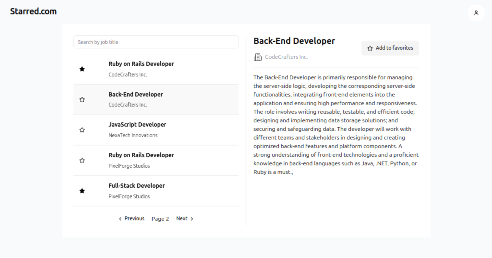
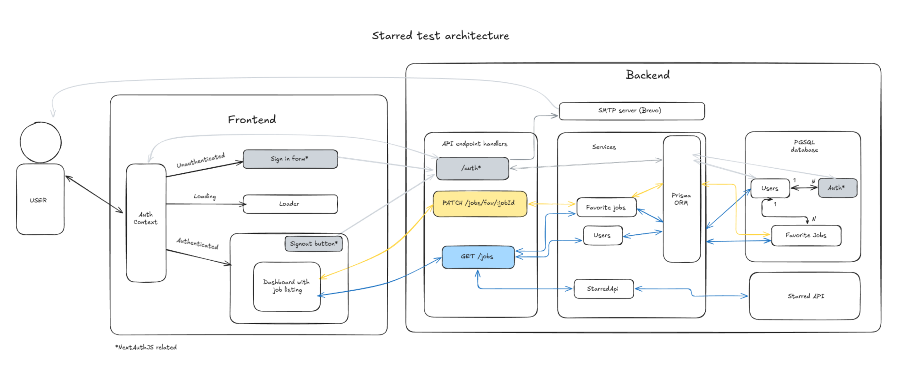

# Introduction

  
   

This project is a technical test based on [this repository](https://github.com/starred-com/starred-case).

You can access a live version here [starred-test.vercel.app](https://starred-test.vercel.app/).

# Installation

## Requirements
- Node >= 18.18.0
- npm >= 9.3.0
- PostGreSQL database
- SMTP server 
- valid email

1. Create `.env` file from `.env.example`
2. Install dependencies: `npm install`
3. Run project: `npm run dev`
4. Project runs on `localhost:3000` 

# Features
The project is a basic listing of jobs from a provided API.

Main features include:
- Authentication with magic link
- Listing jobs
- Filter jobs from their title
- Navigate among jobs with pagination
- View job details
- Add/remove a job from favorites
- Logout
- Live version online
- Automatic deployment

# Next steps

- Standard RESTFul API
  - add/remove job to favorites is not idempotent + doesn't return updated data
- Filter by favorite jobs
- Filter persistency using URL to easily save a search
- Responsive design for mobile
- Error management (frontend & backend)
- Data validation (e.g Zod)
- Frontend cache management (e.g React Query)
- Backend cache management (e.g Redis)
- More endpoints
  - get job by id
  - bulk add jobs to favorites
  - bulk remove job from favorites
  - get users
- Admin dashboard: see users, favorites...
- Optimistic update when adding/removing a favorite
- Go to first/last page
- Add several auth providers (LinkedIn, Google...)
- Unit testing
- Custom magic link email
- Custom home + signin pages
- Branding
- Dockerization to locally launch the project easily
- Linter + formatter

# Technical information

## API endpoints

- `GET` `/api/jobs` list all jobs
- `PATCH` `/api/jobs/fav/:jobId` toggle job from favorites

## Architecture overview

  
   

## Tech used

- **TypeScript** for type-safe environment
- **Next.JS** for easy app deployment and hosting on Vercel.
- **Vercel** + **Supabase** for hosting
- **Prisma** for database ORM
- **TailwindCSS** + **shadcn** for styling

